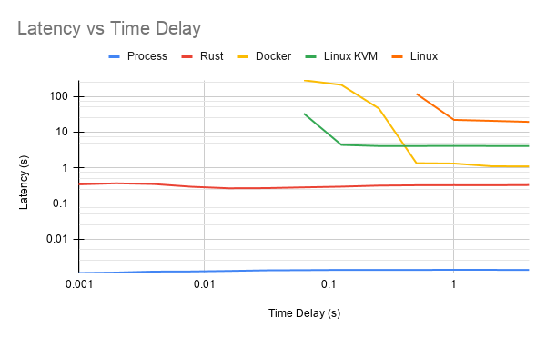
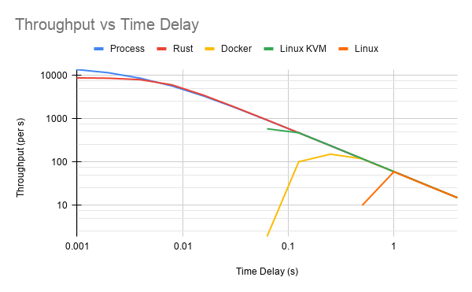

# kernel-benchmark

Scripts to compare the performance of minimal Rust kernel running in QEMU, a Linux kernel running in QEMU (with and without KVM enabled), a Docker container, and a Linux process.

This project is the result of operating systems research by Oliver Calder with Aaron Bauer at Carleton College.

There are four primary categories of scripts:

- [Setup scripts](#setup-scripts): scripts which are run once at setup time, and need only be re-run whenever a change has been made to one of the kernels or when a new QEMU disk image needs to be created.
- [Start scripts](#start-scripts): scripts which instantiate a single VM, container, or process, with various options to specify the behavior and output.
- [Benchmark scripts](#benchmark-scripts): scripts which stress test a system's ability to handle concurrent requests by repeatedly invoking the corresponding start script with a specified time step between each invocation.
- [Result scripts](#result-scripts): two scripts (`get_avg_latency.py` and `get_avg_throughput.py`) which extract data from the output of the benchmarks.

The results from the benchmarks we conducted can be found in the Results directory, and are shown in the [Results](#results) section at the bottom of this README. Provided are csv files with the latencies and throughputs at various time delays, as well as several line graphs and a bar graph as pngs. All tests were performed on a dual-socket Intel Xeon E5-2699 v3 @ 2.30GHz with a total of 72 logical cores and 377.7 GiB total memory and a network-mounted filesystem. The host OS was Ubuntu 16.04.6 LTS with Linux kernel 4.4.0, running Docker version 18.09.7, QEMU version 2.5.0, and rustc 1.47.0-nightly.

## Setup scripts

These scripts download and compile the Linux and Rust kernels, as well as allow the user to build or modify QEMU disk images. They must be run before running any of the start or benchmark scripts.

### `build_linux.sh`

Downloads and compiles the Linux kernel 5.8 from [https://github.com/torvalds/linux](https://github.com/torvalds/linux).

Additionally, calls `create_image.sh` if the user types `y` or pipes `y` into stdin.

#### Usage:

```bash
$ bash build_linux.sh
```

#### Dependencies:

- `git`
- `libelf-dev`
- `libssl-dev`
- `flex`
- `bison`
- `qemu-system`

### `build_rust.sh`

Downloads and compiles the Rust kernel from [https://github.com/olivercalder/rust-kernel](https://github.com/olivercalder/rust-kernel). The kernel is based on the excellent blog by Phil Opperman, which can be found at [https://os.phil-opp.com](https://os.phil-opp.com). To modify the Rust kernel, replace the `async fn sample_application()` with one or more asynchronous functions and call them from the `async fn run_application()` using `.await` just as the sample function shows.

The Rust kernel requires Rust nightly and several additional crates and tools, so it is highly recommended to use this script to get the Rust compiler set up properly the first time the kernel is compiled. It only pulls the `rust-kernel` repository if the directory does not already exist, so you are encouraged to modify the Rust kernel and then recompile the changes using this script.

Due to the way in which the bootable binary is created by the external `bootimage` crate, full compilation requires calling `cargo run --release`, which opens the compiled binary in QEMU. The script does this automatically, and then waits for QEMU to start so it can kill the process.

#### Usage:

```bash
$ bash build_rust.sh
```

#### Dependencies:

- `git`
- `rustup` -- install using official instructions [here](https://www.rust-lang.org/tools/install), NOT through a package manager
- `qemu-system`

### `create_image.sh`

Creates a new blank QEMU disk image and populates it with a Debian 10 build.

The script mounts the disk image in order to perform some setup (such as removing the root password and enable automatic login to the serial console), and thus it **requires root privileges**. Additionally, building the Debian image requires access to `debootstrap`, which may only be available on Debian-based Linux distributions.

If you do not have root privileges or access to a Debian-based Linux distribution, you can download a pre-built QEMU disk image from [https://calder.dev/files/qemu_image.img](https://calder.dev/files/qemu_image.img). For benchmarks, the timescript image was used from [https://calder.dev/files/qemu_image_timescript.img](https://calder.dev/files/qemu_image_timescript.img).

#### Usage:

```bash
$ bash create_image.sh [OPTIONS]
```

Option      | Description
----------- | -----------
`-h`        | Display help
`-i`        | Specify the filename for the new QEMU disk image
`-s <size>` | Create a disk image with the given size, default 384M (format information can be found in the `qemu-img` manpage)

#### Dependencies:

- `git`
- `qemu-utils`
- `mkfs.ext2`
- `debootstrap`
- `mount` and `chroot` (`sudo` privileges)

### `edit_image.sh`

Modifies a QEMU disk image by copying all specified scripts to the disk image (`/root` directory) and adding calls to each script and `shutdown now` in `/root/.profile`. For each script, the script call is added to `/root/.profile` iff there exist a "shebang" at the top of the file, ie. `#!/bin/bash` or `#!/usr/bin/env python3`.

If no scripts are specified and the `-s` flag is not passed, then simply mount the disk image and `chroot` into it which requires root privileges.

#### Usage:

```bash
$ bash edit_image.sh [OPTIONS] [SCRIPT] [...]
```

Option              | Description
------------------- | -----------
`-h`                | Display help
`-i <imagename>`    | Specify the filename of the QEMU disk image to be modified
`-s`                | Write `shutdown now` to `/root/.profile`, regardless of whether one or more scripts are passed as arguments

#### Dependencies:

- `mount` and `chroot` (`sudo` privileges)

## Start scripts

These scripts start an instance of their respective process formats, namely:

- A Docker container
- A Linux kernel with Debian 10 running in QEMU (with or without KVM)
- A Linux process running directly on the host
- A minimal Rust unikernel running in QEMU

### `start_docker.sh

Starts a Docker container running the specified command. If no command is specified, runs `docker run hello-world` by default.

#### Usage:

```bash
$ bash start_docker.sh [OPTIONS]
```

Option                      | Description
--------------------------- | -----------
`-h`                        | Display help
`-b <resultfile>`           | Benchmark mode: write the instance's ID (a timestamp) to the given file once docker exits
`-i '<docker commands>'`    | Execute the given commands -- if absent, the script defaults to `docker run hello-world`
`-o <outfile>`              | Write start and end timestamps to the given output file -- if absent, the output file defaults to `qemu-docker-<ID>.output`, where ID is a unique timestamp
`-p <outdir>`               | Write the output file to the given directory

#### Dependencies:

- `docker` -- on Ubuntu-based distributions, this package is called `docker.io`, while the `docker` package is a gtk applet. Be sure to install the actual docker runtime on your system.

### `start_linux.sh`

Starts the Linux kernel in QEMU with the given QEMU disk image and runs any scripts which are passed as arguments. The kernel should have been previously created using `build_linux.sh`, and the disk image should have been previously built using `create_image.sh` (or downloaded from [https://calder.dev/files/qemu_image.img](https://calder.dev/files/qemu_image.img) or [https://calder.dev/files/qemu_image_timescript.img](https://calder.dev/files/qemu_image_timescript.img)).

#### Usage:

```bash
$ bash start_linux.sh [OPTIONS] [SCRIPT] [...]
```

Option              | Description
------------------- | -----------
`-h`                | Display help
`-b <resultfile>`   | Benchmark mode: write the instance's ID (a timestamp) to the given file once QEMU exits
`-d`                | Debug mode: preserve QEMU display (do not set `-display none`) and do not redirect serial output to an I/O pipe
`-k`                | Enable KVM in QEMU
`-l`                | Long lived: do not add `shutdown now` call to the disk image's `/root/.profile`, as is done by default
`-n`                | Do not modify or copy the disk image -- this ignores any scripts which are passed as arguments and would otherwise be added to the disk image before startup
`-i <imagefile>`    | Use the specified QEMU disk image as the base image
`-o <outfile>`      | Write start and end timestamps, as well as the output of any scripts, to the given output file -- if absent, the output file defaults to `qemu-linux[--enable-kvm]-<ID>.output`, where ID is a unique timestamp, and `--enable-kvm` is present iff the `-k` flag is present
`-p <outdir>`       | Write the output file to the given directory

#### Dependencies:

- `mkfifo`
- `qemu-system`

### `start_process.sh`

Starts the given process natively via a bash command on the host machine. If no command is specified, this defaults to `echo $(date +%s%N) Hello World!`.

#### Usage:

```bash
$ bash start_process.sh [OPTIONS]
```

Option                  | Description
----------------------- | -----------
`-h`                    | Display help
`-b <resultfile>`       | Benchmark mode: write the instance's ID (a timestamp) to the given file once QEMU exits
`-i '<shell commands>'` | Execute the given shell commands, which must be specified inside single quotes and will be called using `eval`, so they can contain variable references -- if absent, the script defaults to `echo $(date +%s%N) Hello World!`
`-o <outfile>`          | Write stand and end timestamps, as well as the output of the commands, to the given file -- if absent, the output file defaults to `process-<ID>.output`, where ID is a unique timestamp
`-p <outdir>`           | Write the output file to the given directory

#### Dependencies:

No dependencies beyond any programs you choose to call from the shell commands.

### `start_rust.sh`

Starts the Rust unikernel in QEMU. The kernel should have been previously created using `build_rust.sh`. The design of the kernel is based on the excellent blog by Phil Opperman, which can be found at [https://os.phil-opp.com](https://os.phil-opp.com).

To modify the Rust kernel, replace the `async fn sample_application()` with one or more asynchronous functions and call them from the `async fn run_application()` using `.await` just as the sample function shows. After making changes, the kernel should be recompiled using the `build_rust.sh` script.

#### Usage:

```bash
$ bash start_rust.sh [OPTIONS]
```

Option                  | Description
----------------------- | -----------
`-h`                    | Display help
`-b <resultfile>`       | Benchmark mode: write the instance's ID (a timestamp) to the given file once QEMU exits
`-d`                    | Debug mode: preserve QEMU display (do not set `-display none`) and do not redirect serial output to an I/O pipe
`-i <path/to/binary>`   | Boot from the given Rust kernel binary -- if absent, the binary defaults to `rust-kernel/test_os/target/x86_64-test_os/release/bootimage-test_os.bin`
`-o <outfile>`          | Write start and end timestamps, as well as any serial output, to the given file -- if absent the output file defaults to `qemu-rust-<ID>.output`, where ID is a unique timestamp
`-p <outdir>`           | Write the output file to the given directory

#### Dependencies:

- `qemu-system`
- `rustup` -- required to build the kernel, though not strictly required to run it

## Benchmark scripts

These scripts run performance benchmarks on their respective process formats by repeatedly calling the correponding start script, with each invocation separated by a specified time step. The benchmarking methodology is shared between all benchmark scripts, and consists of two core components:

1. Asynchronously begin a function which waits for a given warmup time, then writes `BEGIN BENCHMARK: ID ...` to the result file, then waits for the given test time, then writes `END BENCHMARK: ID ...` to the result file
2. Begin a for loop which, for each iteration, calls the corresponding start function with the appropriate parameters in the background (terminated by `&`) and then waits for the duration of the given time step using `sleep`.

For the official benchmarks, a warmup time of 120 seconds and a test time of 60 seconds were used. For each, trials are run beginning with a time step of 4 seconds, and that time step is halved until either the time step reaches 1/512 second or the benchmark becomes unresponsive on our test machine, which occurs at a time step of 0.5 for Linux running without KVM, for example.

All tests were performed on a dual-socket Intel Xeon E5-2699 v3 @ 2.30GHz with a total of 72 logical cores and 377.7 GiB total memory and a network-mounted filesystem. The host OS was Ubuntu 16.04.6 LTS with Linux kernel 4.4.0, running Docker version 18.09.7, QEMU version 2.5.0, and rustc 1.47.0-nightly.

Note that the overhead of iterating through a loop in bash, initiating the backgrounded processes, and using the `sleep` command become increasingly significant as the time step approaches 1 millisecond (as the benchmarks do in the case of the Rust kernel and Linux process). Thus, changes in the time step are not directly proportional to the true time between subsequent spawns. However, since all benchmark scripts use the same methodology and time steps, the benchmarks allow for direct comparison between the performances of the various process formats, which is the primary goal of the experiment.

### `benchmark_docker.sh`

Benchmarks the performance of running multiple Docker containers under load by repeatedly invoking `start_docker.sh`. By default, each instance calls `docker run hello-world`, but this can be adjusted using options described below.

#### Usage:

```bash
$ bash benchmark_docker.sh [OPTIONS]
```

Option                      | Description
--------------------------- | -----------
`-h`                        | Display help
`-i '<docker commands>'`    | Execute the given Docker commands, rather than `docker run hello-world`
`-m`                        | Mute output from `start_docker.sh` stdout -- pipe 1> /dev/null
`-o <resultfile>`           | Write `start_docker.sh` IDs and begin and end benchmark outputs to the given result file -- if absent the output file defaults to `benchmark-docker-<ID>-results.txt`, where ID is a unique timestamp
`-p <outdir>`               | Pass `-p <outdir>` on to `start_docker.sh`
`-r <rate>`                 | Set the timestep in seconds between calls to spawn a new container -- defaults to 10
`-t <duration>`             | Set the duration of the benchmark in seconds -- defaults to 60
`-w <duration>`             | Set the duration of the warmup period in seconds prior to the benchmark -- defaults to 60

#### Dependencies:

Shares the dependencies of `start_docker.sh`.

### `benchmark_linux.sh`

Benchmarks the performance of running multiple Linux kernels in QEMU under load by repeatedly invoking `start_linux.sh`. By default, any scripts which are listed as arguments to `benchmark_linux.sh` are first added to the QEMU disk image using `edit_image.sh`, and then that image is used by all Linux VMs which are spawned.

For official benchmarks, a QEMU disk image preconfigured to run `timescript.sh` after booting was used, along with the `-n` flag to indicate that the image should not be modified by `benchmark_linux.sh`. The disk image can be found at [https://calder.dev/files/qemu_image_timescript.img](https://calder.dev/files/qemu_image_timescript.img).

#### Usage:

```bash
$ bash benchmark_linux.sh [OPTIONS] [SCRIPT] [...]
```

Option              | Description
------------------- | -----------
`-h`                | Display help
`-d`                | Debug mode: pass -d flag on to `start_linux.sh`
`-i <imagefile>`    | Use the specified QEMU disk image as the base image
`-k`                | Enable KVM in QEMU
`-n`                | Do not modify or copy the disk image -- this ignores any scripts which are passed as arguments and would otherwise be added to the disk image before startup
`-o <resultfile>`   | Write `start_linux.sh` IDs and begin and end benchmark outputs to the given result file -- if absent the output file defaults to `benchmark-linux[-k]-<ID>-results.txt`, where ID is a unique timestamp
`-p <outdir>`       | Pass `-p <outdir>` on to `start_linux.sh`
`-r <rate>`         | Set the timestep in seconds between calls to spawn a new VM -- defaults to 10
`-t <duration>`     | Set the duration of the benchmark in seconds -- defaults to 60
`-w <duration>`     | Set the duration of the warmup period in seconds prior to the benchmark -- defaults to 60

#### Dependencies:

Shares the dependencies of `start_linux.sh`.

### `benchmark_process.sh`

Benchmarks the performance of running multiple Linux processes under load by repeatedly invoking `start_process.sh`. By default, each instance calls `echo $(date +%s%N) Hello World!`, but this can be adjusted using options described below.

#### Usage:

```bash
$ bash benchmark_process.sh [OPTIONS]
```

Option                  | Description
----------------------- | -----------
`-h`                    | Display help
`-i '<shell commands>'` | Pass the given shell commands on to `start_process.sh`, which must be specified inside single quotes and will be called using `eval`, so they can contain variable references -- if absent, the script defaults to `echo $(date +%s%N) Hello World!`
`-o <resultfile>`       | Write `start_process.sh` IDs and begin and end benchmark outputs to the given result file -- if absent the output file defaults to `benchmark-process-<ID>-results.txt`, where ID is a unique timestamp
`-p <outdir>`           | Pass `-p <outdir>` on to `start_process.sh`
`-r <rate>`             | Set the timestep in seconds between calls to spawn a new process -- defaults to 10
`-t <duration>`         | Set the duration of the benchmark in seconds -- defaults to 60
`-w <duration>`         | Set the duration of the warmup period in seconds prior to the benchmark -- defaults to 60

#### Dependencies:

No dependencies beyond any programs you choose to call from the shell commands.

### `benchmark_rust.sh`

Benchmarks the performance of running multiple Rust kernels in QEMU under load by repeatedly invoking `start_rust.sh`.

For official benchmarks, the Rust kernel was used directly from [https://github.com/olivercalder/rust-kernel](https://github.com/olivercalder/rust-kernel), which prints to the serial port and then calls `exit_qemu()`. The Rust kernel should be compiled using `build_kernel.sh` before running the benchmark.

#### Usage:

```bash
$ bash benchmark_rust.sh [OPTIONS] [SCRIPT] [...]
```

Option                  | Description
----------------------- | -----------
`-h`                    | Display help
`-d`                    | Debug mode: pass -d flag on to `start_rust.sh`
`-i <path/to/binary>`   | Boot from the given Rust kernel binary -- defaults to `rust-kernel/test_os/target/x86_64-test_os/release/bootimage-test_os.bin`
`-o <resultfile>`       | Write `start_rust.sh` IDs and begin and end benchmark outputs to the given result file -- if absent the output file defaults to `benchmark-rust-<ID>-results.txt`, where ID is a unique timestamp
`-p <outdir>`           | Pass `-p <outdir>` on to `start_rust.sh`
`-r <rate>`             | Set the timestep in seconds between calls to spawn a new VM -- defaults to 10
`-t <duration>`         | Set the duration of the benchmark in seconds -- defaults to 60
`-w <duration>`         | Set the duration of the warmup period in seconds prior to the benchmark -- defaults to 60

#### Dependencies:

Shares the dependencies of `start_rust.sh`.

### `run_benchmarks.sh`

This script runs the full suite of benchmarks which were used to generate the results included in the Results folder and discussed below.

All tests were performed on a dual-socket Intel Xeon E5-2699 v3 @ 2.30GHz with a total of 72 logical cores and 377.7 GiB total memory and a network-mounted filesystem. The host OS was Ubuntu 16.04.6 LTS with Linux kernel 4.4.0, running Docker version 18.09.7, QEMU version 2.5.0, and rustc 1.47.0-nightly.

The minimum time steps used in this script reflect the capabilities of the test system, and should be adjusted for use on other systems.

#### Usage:

```bash
$ bash run_benchmarks.sh
```

#### Dependencies:

Depends on all other `benchmark_*.sh` scripts and their dependencies.

## Result scripts

After using `run_benchmarks.sh` to generate outputs for all systems in question, the performance was measured in terms of latency and throughput. Latency and throughput were calculated using the following scripts.

### `get_avg_latency.py`

Calculates the average latency of one or more benchmarks by extracting timestamps from the output files generated by the calls to the corresponding `start_*.sh` scripts.

#### Usage:

```bash
$ python3 get_avg_latency.py [OPTIONS] [FILENAME] [...]
```

Option              | Description
------------------- | -----------
`-h`                | Display help
`-t <type>`         | MANDATORY: Specify the format of the output file so that script can differentiate successes from failures and the correct timestamps are used to calculate latency -- discussed in more depth below
`-d <directory>`    | Treat all files in the given directory as output files used in the calculation -- necessary to get around the maximum number of shell arguments when dealing with benchmarks which create hundreds of thousands of instances, and thus output files

By default, the following types are supported and expect the given formats:

- `linux`
    - Expects format:  
```
<timestamp> QEMU initiated
<timestamp> VM successfully running
<timestamp> QEMU exited successfully
```
    - Latency is calculated as the timestamp from the `VM successfully running` line minus the timestamp from the `QEMU initiated` line
    - If `QEMU exited successfully` is not present, then that trial is treated as unsuccessful and omitted from the results, though noted as a failure
- `rust`
    - Expects format:  
```
<timestamp> QEMU initiated
Hello 42!   # or other serial output... doesn't matter
<timestamp> QEMU exited with error code 33
```
    - Latency is calculated as the timestamp from the `QEMU exited with error code 33` line minus the timestamp from the `QEMU initiated` line
    - If the error code is something other than 33 (or that line doesn't exist), then that trial is treated as unsuccessful and omitted from the results, though noted as a failure
- `docker`
    - Expects format:  
```
<timestamp> Docker initiated
<timestamp> Docker exited successfully
```
    - Latency is calculated as the timestamp from the `Docker exited successfully` line minus the timestamp from the `Docker initiated` line
    - If `Docker exited successfully` is not present, then that trial is treated as unsuccessful and omitted from the results, though noted as a failure
- `process`
    - Expects format:  
```
<timestamp> Process initiated
<timestamp> Hello World!
<timestamp> Process exited successfully
```
    - Latency is calculated as the timestamp from the `Hello World!` line minus the timestamp from the `Process initiated` line
    - If `Processes exited successfully` is not present, then that trial is treated as unsuccessful and omitted from the results, though noted as a failure

It is expected for the user to modify or add new options according to the modifications they make to the scripts, kernel, docker, or shell commands. This can be done by following the template which has been used for the others; namely, adding the option to the list and adding another `elif` body which parses the output accordingly.

#### Dependencies:

- `python3`

### `get_avg_throughput.py`

Calculates the average throughput of one or more benchmarks by extracting timestamps from the result files generated by the corresponding `benchmark_*.sh` script.

#### Usage:

```bash
$ python3 get_avg_throughput.py FILE [FILE] [...]
```

#### Dependencies:

- `python3`

## Results

We executed `run_benchmarks.sh` and computed the latencies and throughputs from the output files using the scripts above. The raw data, as well as charts, can be found in the `Results` directory. Again, all tests were performed on a dual-socket Intel Xeon E5-2699 v3 @ 2.30GHz with a total of 72 logical cores and 377.7 GiB total memory and a network-mounted filesystem. The host OS was Ubuntu 16.04.6 LTS with Linux kernel 4.4.0, running Docker version 18.09.7, QEMU version 2.5.0, and rustc 1.47.0-nightly. The results are discussed below.

### Latency without contention

First, the latencies of each system when there is no contention (ie. the `start_*.sh` script is called when no other scripts are running) are shown in the chart below.


From the chart, we see that the process outperforms all other systems, with a latency on the order of a few milliseconds. The Rust unikernel running in QEMU performs second best, on the order of around 2^-2 seconds. Following this, Docker has a latency of slightly less than one second, on the order of 2^0 seconds. Next, Linux in QEMU with KVM enabled has a latency a few times higher than a container, on the order of 2^2 seconds. Lastly, Linux without KVM enabled has a latency of around 2^4 seconds. Thus, with the exception of the process, we can see that the increases rather steadily by around two orders of magnitude.

### Latency vs time delay

Next, the latencies of each system when under load are shown in the chart below. In this chart, the x-axis represents the added time delay between each invocation of the `start_*.sh` function. This time delay begins at 4 seconds and decreases by half for each benchmark until the host system can no longer handle the load.



We once again see that the process outperforms all other systems, and that it has a minimal increase in latency as load increases. The Rust kernel is the only other system for which latency does not increase under load. Interestingly, though Docker begins with a latency lower than that of Linux with KVM, we see that latency spikes dramatically between the time delays of 0.5 and 0.25 seconds.Linux with KVM fares much better, yielding no noticable increase in latency until the time delay decreases below 0.125 seconds. Without KVM, Linux has a much higher latency, and with a time delay of 0.5, many of the VMs fail to properly initialize (due to contention for `udev`) and thus hang indefinitely. QEMU with KVM thus provides admirable benefits over QEMU alone. This makes it even more impressive that the Rust kernel, running on QEMU without KVM, is able to perform very well under a load much heavier (32x heavier) than Linux running with KVM.

### Throughput vs time delay

Lastly, the throughputs of each system under load are show in the chart below. Once again, the x-axis represents the added time delay between each invocation of the `start_*.sh` function, which begins at 4 seconds and decreases by half for each benchmark until the host system can no longer handle the load.



The throughputs align closely with the latencies above: when latency increases, we see a drop in throughput. Notably, however, when Docker and QEMU with KVM experience their first spikes in latency, the throughput at that same time delay continues to increase, albeit at a much lower rate. As the time delay increases, the latency of Docker continues to increase, and between time delays of 0.125 and 0.0625 seconds, resource contention causes the throughput of Docker to drop to near zero. In particular, Docker began to throw errors about `fork` being unavailable, since Docker had managed to fork 1546814 (`ulimit -u`) processes. This was not a problem with any other system, even when spawning instances at a rate 32x as high as Docker's breaking point.

Linux without KVM, as before, had the lowest throughput of all. This is likely because both Docker and Linux without KVM run complex runtimes which themselves operate fully atop the host kernel, whereas KVM grants the Linux kernel direct hardware access, and processes are vastly more lightweight.

Thus, the anomaly is again the Rust kernel which, despite running in standard QEMU without KVM, is still able to scale better under load than anything other than a process. Only when the time delay approaches the time required to initiate a process can we see the throughput the Rust kernel begin to fall below that of the process. No time delays below 0.001953125 seconds (1/512) were tested, since at that point the time delays become less significant compared to the overhead of spawning and backgrounding a new process from bash. Thus, despite its higher base latency than a process, the throughput of the Rust kernel was able to scale with load as well as a process until the time delay approached 5 milliseconds, and after that, throughput continued to increase, albeit at a decreased rate.

## Acknowledgements

The most significant inspiration for this work came from the paper by Koller and Williams titled "Will Serverless End the Dominance of Linux in the Cloud?", which can be found at [https://dl.acm.org/doi/10.1145/3102980.3103008](https://dl.acm.org/doi/10.1145/3102980.3103008).

The design of the core Rusk unikernel is the work of Philipp Oppermann, whose Rust kernel blog can be found at [https://os.phil-opp.com](https://os.phil-opp.com).
